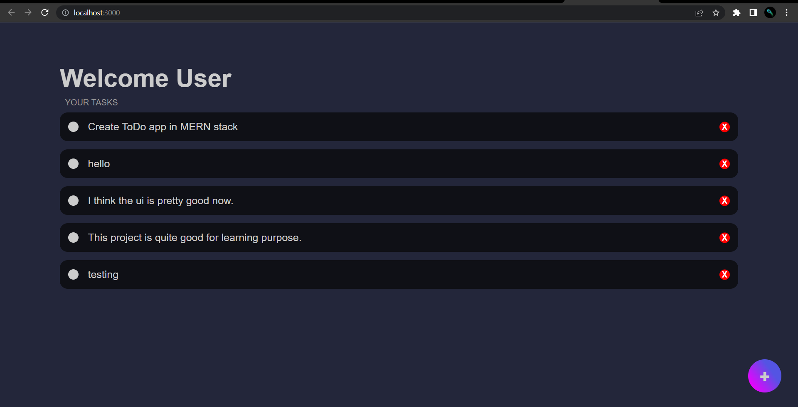
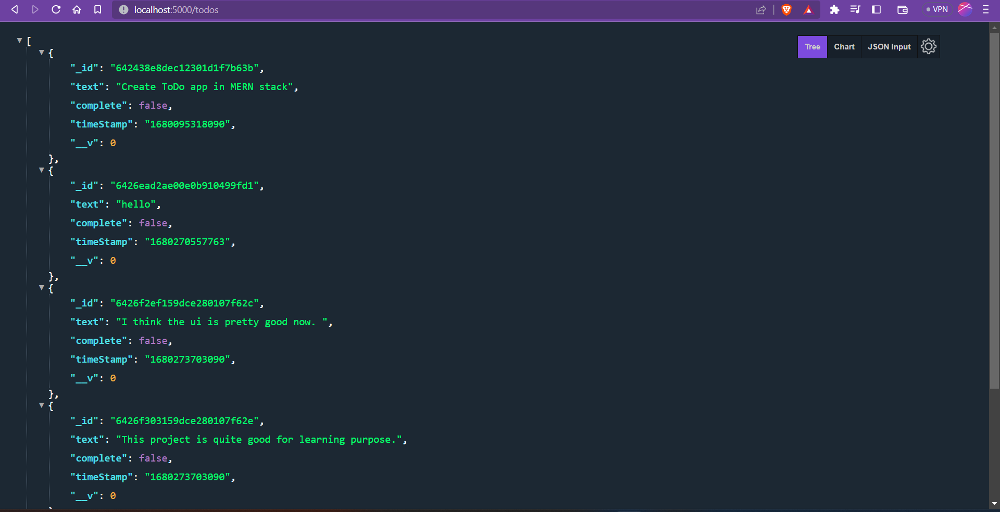

# **Todo webapp using MERN**

## _Italic_

---
- This is a bullet point
* this is also bullet point

---
_Put code in Readme_

```javascript
const mongoose = require("mongoose");
const Schema = mongoose.Schema;

const TodoSchema = new Schema({
    text:{
        type: String,
        required: true
    },
    complete:{
        type: Boolean,
        default: false
    },
    timeStamp:{
        type: String,
        default: Date.now()
    }
})

const Todo = mongoose.model("Todo",TodoSchema);

module.exports = Todo;
```
I have installed a vscode extension called paste image for directly pasting screenshots.

Ui:



API:
